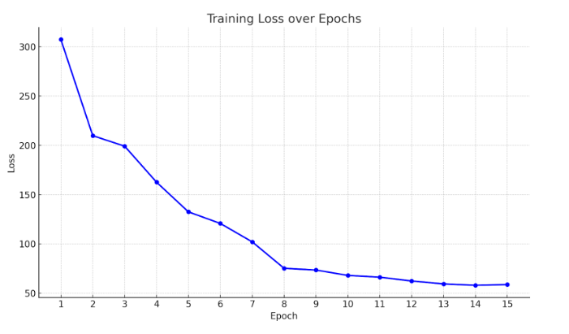

## NYCU Computer Vision 2025 Spring HW3     
Student ID: 110550124     
Name: 林家甫     

## Introduction 
The core objective of this homework is to use the Mask R-CNN machine learning model to identify four different types of cells in the given images. The model not only detects which category each object belongs to but also localizes where each object appears in the image through pixel-level segmentation.     
The dataset consists of 209 training images and 101 test images, all in .tif format. Each training image is accompanied by up to four corresponding mask images. In each mask image, multiple objects are labeled with unique integer values starting from 1, while the background pixels are labeled as 0.        
   

## How to install 
Main Packages   
Dataset Link: https://drive.google.com/file/d/1B0qWNzQZQmfQP7x7o4FDdgb9GvPDoFzI/view     
Pytorch: https://pytorch.org/       
Anaconda: https://www.anaconda.com/docs/getting-started/anaconda/install        


## Dataset structure   
```
dataset/
├── train/
│   ├── image_001/
│   │   ├── image.tif
│   │   ├── class1.tif
│   │   ├── class2.tif
│   │   ├── class3.tif
│   │   └── class4.tif
│   ├── image_002/
│   │   ├── image.tif
│   │   ├── class1.tif
│   │   └── class3.tif
│   └── ... (more image folders)
│   
├── test_release/
│   ├── img_001.tif
│   ├── img_002.tif
│   └── ... (more .tif test images)
│
└── test_image_name_to_ids.json

```

## How to run
- Train: 
    `python main.py` 

- Infer: 
    `python test.py`
 
## Peformance Snapshot    
Reach mAP: 0.4075 on public dataset on Codabench    

